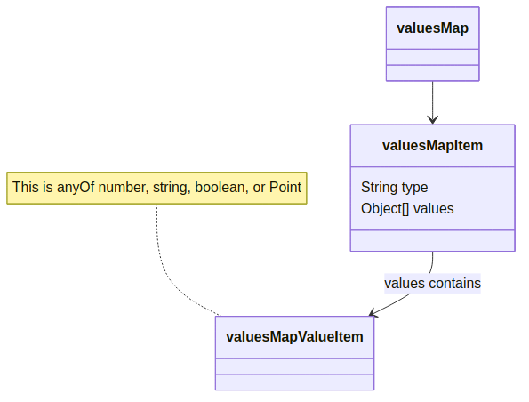

# Recommended Implementation for utilizing enumeration schemas in the OpenADR RI

Written by: David Herron - Evoke Systems - <david@davidherron.com> or <david.herron@evokesystems.com>

Date: February 3, 2025

## Introduction

The OpenADR 3.x Reference Implementation (RI) serves as an example for other OpenADR VEN and VTN implementors.

The enumeration schemas are intended to assist OpenADR 3.x implementors (both VTN and VEN) to validate the contents of data fields whose values are listed in the enumeration tables in Definition.md.  Those enumerations describe the allowed values for the fields corresponding to each table.  Primarily, the enumeration tables describe certain `valuesMap` array contents.

The schema files are written in JSON Schema format.  For the enumeration tables corresponding to a `valuesMap` - such as the payloads table in a Report - the payloads field is a `valuesMap`.  Remember that a `valuesMap` is an array of objects with a _type_ name and a _values_ array.  The `valuesMap` object is structured like so:

<!--  -->

<diagrams-plantuml output-file="img/valuesMapDefinition.png" tpng>
@startuml

    title "Figure 1. valuesMap definition"

    class valuesMap {
    }
    
    class valuesMapItem {
        String type
        Object[] values
    }


    class valuesArrayItem {
    }

    valuesMap "0" *-- "many" valuesMapItem : Contains
    
    valuesMapItem::values "0" *-- "many" valuesArrayItem
    
    note right of valuesMapItem
       The value for "type" comes is one of the names
       in an enumeration table.
       
       The allowed data in "values" is described by
       the text in the enumeration table.
    end note
    
    note right of valuesArrayItem
        This is anyOf integer, number, string, boolean, or Point.
    end note
    
@enduml
</diagrams-plantuml>

It is important for the security and reliability of OpenADR, that all data items must be validated.  For the OpenADR protocol, the schema definitions in the YAML specification serves for generating data validation functions.  For the data described by the enumeration tables, the enumeration schema files are meant to serve two purposes:

1. They concretely define the values described by the enumeration tables.
1. They allow autogeneration of data validation.

Therefore, the use of the enumeration schemas is within the context of data validation within OpenADR VEN or VTN implementations.

It is recommended that the best data validation implementation is at the boundaries of the VEN or VTN.  That means:

* VEN
    * Where it receives a response from a VTN, have data validation for the whole object, and data validation for each field described in an enumeration table
    * Where it sends data to a VTN, have data validation for the whole object, and data validation for each field described in an enumeration table
* VTN
    * Where it receives a request from a VEN, have data validation for the whole object, and data validation for each field described in an enumeration table
    * Where it sends responses to a VEN, have data validation for the whole object, and data validation for each field described in an enumeration table
    * Where it sends notifications, have data validation for the whole object, and data validation for each field described in an enumeration table

This envisions data types and data validation generated in two areas:

1. Each OpenADR 3 schema component (`openadr3.yml#/components/schemas`) in the OpenADR spec defines an object type.  For each, the implementation should include a type declaration, and a data validation function, both of which should be auto-generated.
2. Each enumeration schema component (`TABLE-NAME.schema.json#/definitions`) defines the allowed content for the field described by the enumeration table.  For the case of `valuesMap` arrays, it is describing the allowed content of the `valuesMapItem.values` array.  For each, the implementation should include a data validation function.  Additionally, the implementation should include a function which, for all `valuesMapItems` in a `valuesMap`, uses the correct validation function for that `valuesMapItem`.  The validation function is chosen by the `type` value.

## Concrete example `POST /events`

The `EventRequest` object might a declaration like this TypeScript type:

```js
export type EventRequest = {
  programID: ObjectID;
  /**
   * User defined string for use in debugging or User Interface.
   *
   * @example price event 11-18-2022
   * @default null
   */
  eventName?: string | null;
  /**
   * Relative priority of event. A lower number is a higher priority.
   *
   * @minimum 0
   * @example 0
   * @default null
   */
  priority?: number | null;
  /**
   * A list of valuesMap objects.
   *
   * @default null
   */
  targets?: ValuesMap[] | null;
  /**
   * A list of reportDescriptor objects. Used to request reports from VEN.
   *
   * @default null
   */
  reportDescriptors?: ReportDescriptor[] | null;
  /**
   * A list of payloadDescriptor objects.
   *
   * @default null
   */
  payloadDescriptors?: EventPayloadDescriptor[] | null;
  intervalPeriod?: IntervalPeriod;
  /**
   * A list of interval objects.
   */
  intervals: Interval[];
};
```

Type declarations like this can be generated from the YAML specification.  Such tools should generate a similar type declaration for all schema entries in `openadr3.yml#/components/schemas`.

Data type validation functions can also be autogenerated.  Such a function is given an object of unknown type, and inspects its characteristics to show `true`/`false` whether it is, or is not, of the expected type.

For a communications protocol, like OpenADR, the software receives data from the remote software, and before acting on that data it must validate that the object is actually what it's supposed to be.

Data validation functions should have a signature like this, one for each data type:

```js
isDataTypeName(data: any): boolean
```

This is roughly TypeScript notation for a function that accepts any kind of data object.  In TypeScript, the type `any` means the variable could be of any type.  Another option is to use the `unknown` type instead.  The function is to return a `true`/`false` indicating whether the object matches that data type.  In TypeScript, this is called a [_Type Predicate_](https://www.typescriptlang.org/docs/handbook/2/narrowing.html#using-type-predicates), which is a way of helping the compiler understand the actual type of an object.

Generally speaking a boundary function does this:

<diagrams-plantuml output-file="img/boundaryFunctionOverview.png" tpng>
@startuml

    title "Figure 2. OpenADR event handler validation"

    start
    
    if (requestParametersOrBodyAreNotCorrectType) then
        #pink:Problem;
        stop
    endif
    
    if (BusinessLogicFails) then
        #pink:Problem;
        stop
    endif
    
    #lightgreen:Return success;
    
    stop

@enduml
</diagrams-plantuml>

So long as handler functions make data validation their first step, the rest of the VEN or VTN implementation has certainty that it has correct data.

Consider the `createEvent` handler function, which is declared in the YAML as handling `POST /events`:

```js
// Server createEvent handler.
export async function createEvent(
    req: Request, res: Response
) {
    // The inbound request could have any data at all, because
    // bugs in the client code could send the wrong data.
    const _event = req?.request?.body;

    if (!isRequestEvent(_event)) {
        // False says the object was not a RequestEvent object.
        // Return a Problem containing (400) Bad Request
        return res.status(400).json({
            title: 'Bad data',
            status: 400
        } as Problem);
    }

    // Otherwise this is a RequestEvent, so we
    // cast _event to that type
    const reqEvent: RequestEvent = _event as RequestEvent;

    // Do whatever business logic for the event
    // such as saving to a database.
    // For any problems return a Problem object
    // Otherwise return a 201 status with the Event

}

function isRequestEvent(data: any): boolean {
    // first, use auto-generated validator function
    if (!isJoiRequestEvent(data)) return false;

    // Next, Check the enumerated values
    if (!checkTargets(reqEvent.targets)
     || !checkReportDescriptors(reqEvent.reportDescriptors)
     || !checkPayloadDescriptors(reqEvent.payloadDescriptors)
     || !checkEventIntervalPayloads(reqEvent.intervals)) {
        return false;
    }
    return true;
}
```

In the `isRequestEvent` function, it's using both the generated validation function, and additional functions to check the valuesMap entries for validity.

In this case, the `isJoiRequestEvent` function refers to the Joi validation framework.  There is a tool for autogenerating Joi validation functions which can be used in this way.  The other functions named here will check the named fields against the corresponding schema definitions.

For every programming platform, surely there exists tools for autogenerating data types and data validation functions from OpenAPI or JSON Schema specifications.

## Validating a `valuesMap` with schema-derived validator functions

Let's consider one entry from `event-interval-payloads.schema.yaml`:

```yaml
    SIMPLE:
        $id: 'event-interval-payloads.schema.json#/definitions/SIMPLE'
        description: |
            An indication of the level of a basic demand response signal. Payload
            value is an integer of 0, 1, 2, or 3.
            Note: An example mapping is normal operations, moderate load shed,
            high load shed, and emergency load shed.
        type: array
        minItems: 1
        maxItems: 1
        items:
            type: integer
            minimum: 0
            maximum: 3
```

`SIMPLE` is one entry in the enumerations table for event payload descriptors.  The description tells us the `values` array is to have one entry, an integer with a value between `0` and `3` inclusive.  The schema describes an array with those characteristics.

Each valuesMap will have a list of entries with a _type_ and a _values_ array.  The _type_ values will almost certainly be different for each valuesMap entry.

<diagrams-plantuml output-file="img/validatingValuesMap.png" tpng>
@startuml

    title "Figure 3. Process for validating a valuesMap for an enumerated field"

    start

    while (another item in valuesMap?)
        :Lookup validation function for "type";
        :Validate "values" array by that function;
        if (item does not validate) then (fail)
            #pink:Problem;
            stop
        else (try next)
        endif
    endwhile
    
    #lightgreen:Success;

@enduml
</diagrams-plantuml>

Therefore, validating an OpenADR `valuesMap` in a given programming language requires:

* Auto-generating or hand-coding a validation function for each _type_ value
* A `valuesMap` validation function which steps through the array, invoking the correct validation for each `valuesArrayItem` entry.

## Concrete example - `EventRequest`

Let's discuss how validation should proceed for the `EventRequest` fields affected by the enumerated tables in Definition.md.

* `targets` is a valuesMap with entries describing the set of VENs affected by the event.  It must be validated against schema entries in `target-types.schema.json`.
* `reportDescriptors` is an array of reportDescriptor objects.  These describe what payloads it is requested that VENs send to the VTN in Reports.  The validation, in this case, is that payloadType field should be listed in `report-payloads.schema.json`.
* `payloadDescriptors` is an array of eventPayloadDescriptor objects.  These describe the payloads that will be included in the `intervals` array.  The validation, in this case, is that the payloadType field should be listed in `event-interval-payloads.schema.yaml`.
* `intervals` is a valuesMap of payload data contained in the event.  The validation, in this case, is that each entry match the corresponding schema declaration in `event-interval-payloads.schema.yaml`.

Earlier we showed four functions:

* `checkTargets(reqEvent.targets)`
* `checkReportDescriptors(reqEvent.reportDescriptors)`
* `checkPayloadDescriptors(reqEvent.payloadDescriptors)`
* `checkEventIntervalPayloads(reqEvent.intervals)`

For `checkReportDescriptors` and `checkPayloadDescriptors` the `payloadType` field must match an entry in the corresponding schema entry.

For `checkTargets` and `checkEventIntervalPayloads`, validator functions must be created for each entry in the corresponding schema files, `target-types.schema.json` and `event-interval-payloads.schema.yaml`.

Auto-generation of those validator functions depends on the tools available for your programming platform.  In the Node.js/TypeScript ecosystem the AJV validator package is useful since it can generate a validation function from a JSON schema.

That means creating an array indexed by the _type_ value which contains the validator function.

For AJV on Node.js/TypeScript, that can be done in this manner:

```js
const _schemaReportPayloads = await readYAMLSchema(
    path.join(__dirname, 'report-payloads.schema.yaml')
);

const validators = new Map<string, {
    type: string,
    validator: Ajv.ValidateFunction
}>;

for (const _key in _schemaReportPayloads.definitions) {
    validators.set(_key, {
        type: _key,
        validator: ajv.compile(_schemaReportPayloads.definitions[_key])
    });
};
```

The `validators` object is a Map where the index is a `string`, the `type` name, and an object containing the `type` name and the `validator` function.

Then, to validate a valuesMap, the loop looks like this:

```js
function checkEventIntervalPayloads(intervals) {
    if (!intervals || !intervals.payloads) {
        return true; // ??? is it valid to not have intervals?
    }
    for (const item of intervals.payloads) {
        const validator = validators.get(item.type.trim());
        if (!validator(item.values)) {
            // Validation failed
            console.error(`FAILED validation with `, validator.errors);
            return false;
        }
    }
    return true;
}
```

Validating the targets array, in `checkTargets`, will follow a similar pattern.  It will read the corresponding schema file, generate validator functions from the schema, and have a similar function.

For `checkReportDescriptors` and `checkPayloadDescriptors` the task is a little simpler, since it only needs to verify the type name against the schema file.


